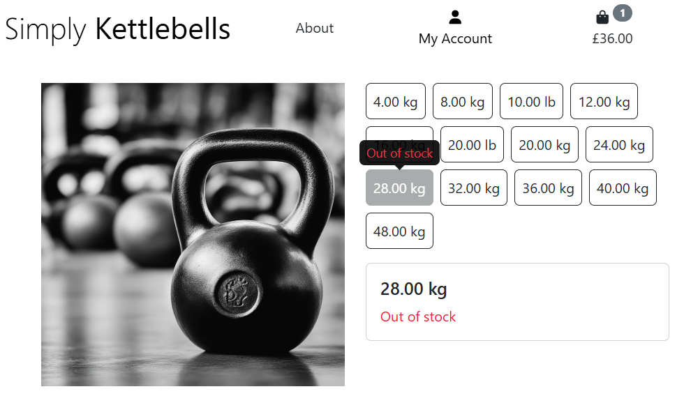
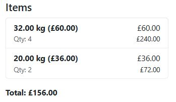

# Simply Kettlebells

A small Django-based e-commerce and content site for selling kettlebells and managing user checkouts, profiles and contact messages. It combines a lightweight product catalog with a session and DB backed basket, Stripe-based payments, order processing with safe stock adjustments, and admin UX improvements.

Deployed: https://simply-kettlebells-4abe1ba989b7.herokuapp.com/

Shop admin site: https://simply-kettlebells-4abe1ba989b7.herokuapp.com/admin/

## Features

* E-commerce Store: Kettlebell model with weight, price (GBP), and stock availability.

* Shopping basket

  Session-backed anonymous basket for guest users.

  DB-backed Basket and BasketItem for authenticated users; items use a GenericForeignKey to link to products.

* Checkout and orders

  Order and OrderLineItem models to persist final purchases and historical prices.

  Safe transfer of user basket into an Order at checkout using a transactional helper.

  Order total computation and storage, preserving historical prices even if product price changes later.

  Payment flows integrated with Stripe (Checkout Session and PaymentIntent).

  Webhook endpoint to handle Stripe events and mark orders as paid.

* Stock management and idempotency

  apply_order_stock_adjustment helper decrements product stock in a transaction using select_for_update to avoid races.

  Order.stock_adjusted boolean tracks whether stock decrement has already been applied; prevents double-decrements from duplicate webhooks or retries.

  OrderLineItem.product foreign key (nullable) to Kettlebell where possible to allow accurate stock mapping.

* User Authentication: Users can register and log in to save a basket and personal details.

  UserProfile model (one-to-one with auth.User) stores Stripe customer id and default address fields.

  Endpoints for saved payment methods and marking a default method.

* Contact messages (contact)

  Admin-friendly display and inline integration: contact messages are shown with a readable textarea and can be seen in Order admin.

* Responsive Design: Built with Bootstrap for a clean and mobile-friendly layout.
* JavaScript Enhancements: Interactive features like dynamic form validation and real-time updates.
* Admin and developer UX

  Admin customizations to show contact messages inline.
  Logging and diagnostics for basket and checkout flows.

### Important flows

Browsing and adding items

Guests: items kept in request.session basket keyed by weight; price stored as string snapshots.
Authenticated users: items stored as DB BasketItem rows referencing content objects.
Checkout

On checkout submission, an Order is created and transfer_basket_to_order copies items into OrderLineItem rows within an atomic transaction.
Historical prices are preserved in OrderLineItem.price, so later product price changes do not affect past orders.
The source basket (session or DB) is cleared only after successful payment/fulfillment to preserve order integrity.
Payment & stock adjustment

After payment confirmation (client call or Stripe webhook), apply_order_stock_adjustment(order):
Finds the product by OrderLineItem.product FK (if present) or by parsing product_name.
Uses select_for_update() in a transaction to decrement product stock safely.
Sets Order.stock_adjusted = True so duplicate webhook events or retries do not double-decrement stock.
Stale session handling

The app detects and removes stale session reservations when an authenticated user still has session basket entries but their DB basket is authoritative; this prevents blocked re-adds or inconsistent stock assertions.

## Development

Data model for this project.

Kettlebell: product entity; fields include weight, weight_unit, price_gbp, available stock.

Basket / BasketItem: DB basket associated with a user; BasketItem uses GenericForeignKey to content objects.

Order / OrderLineItem: persisted orders; OrderLineItem stores product_name, quantity, price and optionally product foreign key to Kettlebell.

UserProfile: user address defaults.

ContactMessage: contact/support messages asociated with user and order.

### Project architecture

### Testing

Initially I did mostly manual testing deploying the project locally after addition of each new feature in process fixing errors and improving users interface. Most time consuming issues were connected with stock tracking and basket calculations.

#### Automated

I started to use automated tests while developing basket app.

Most automated tests I used for checkout as it is most important part of an e-comerce app. I used those tests repeatedly to catch errors when adding changes. A test suite exercises basket copying, checkout flows, webhook idempotency and stock adjustments.
The helper functions and transactional behavior are covered by unit/integration tests in tests.py

## Technologies Used

Backend: Python + Django

Database: PostgreSQL

Frontend: HTML, CSS, JavaScript, Bootstrap

Work environment: Visual Studio Code + Copilot

Payments: Stripe (test mode)

Deployment: Heroku

Version Control: Git + GitHub

### Attribution

Bootstrap: https://getbootstrap.com

Stripe: https://stripe.com

Image generated with deepai.org
